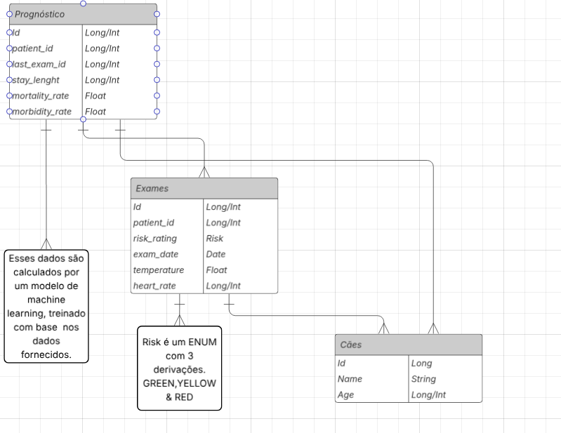

# Projeto Fullstack Nucleotech

Esse projeto foi desenvolvido para o Hackaton Tech 2025 - 1, em conjunto com a Universidade FMU - Centro Universitário das Faculdades Metropolitanas Unidas.

---

## Backend

### Tecnologias

- **Kotlin**: Linguagem principal para o backend.
- **Spring Boot**: Framework para construir APIs REST e lidar com dependências.
- **Spring Data JPA**: Para mapeamento objeto-relacional e persistência no banco.
- **PostgreSQL**: Banco de dados relacional usado na nuvem (exemplo: Render).
- **Gradle**: Gerenciador de dependências e build.
- **Render**: Plataforma que hospeda o banco de dados PostgreSQL

### Funcionalidades

- Disposição dos dados para o frontend
- Estrutura não-acoplada ao modelo

---

## Frontend

### Tecnologias

- **Next.js**: Framework React para renderização do lado servidor e rotas.
- **JavaScript (ES6+)**: Linguagem principal do frontend (sem TypeScript).
- **Typescript**: Linguagem usada para apoio nos componentes Next.
- **Tailwind CSS**: Biblioteca utilitária para estilização rápida e responsiva.
- **PostCSS e Autoprefixer**: Ferramentas para processamento do CSS.

### Funcionalidades

- Exibição dos Dados ( Ficcticios)
- Interface Agradável 
- Integração com o Backend

---

## Como rodar o projeto

### Backend

1. Configure o arquivo `application.properties` com os dados do banco.
2. Execute o projeto via Gradle ou IDE (ex: IntelliJ).
3. A API ficará disponível, por padrão, em `http://localhost:8080`.

### Frontend

1. Navegue até a pasta do frontend.
2. Rode `npm install` para instalar as dependências.
3. Inicie com `npm run dev`.
4. Acesse `http://localhost:3000` no navegador.

---

## Observações

- O backend usa JPA para abstrair queries simples e persistência.
- O frontend não utiliza TypeScript nem ESLint, para simplicidade.
- Banco de dados configurado para rodar na nuvem, garantindo acessibilidade.

---

Projeto criado e mantido por Matheus de Oliveira.

